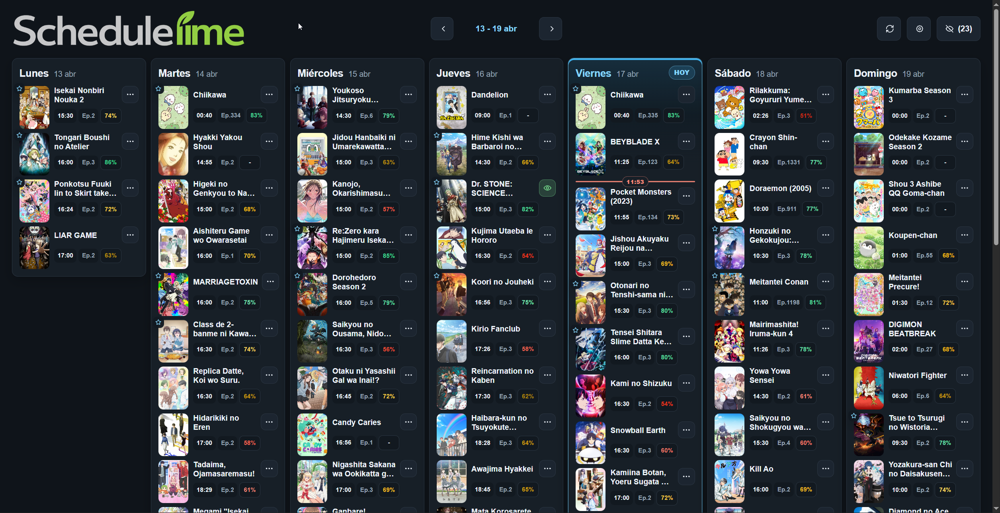
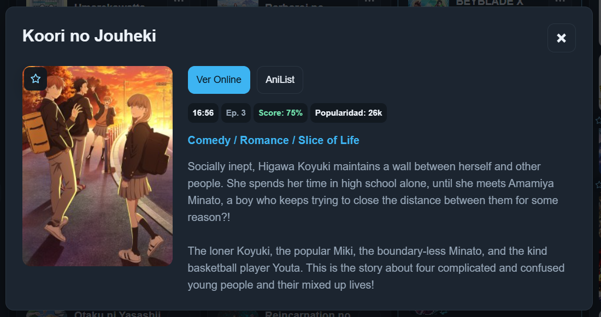

<p align="center">
  
</p>

#

Calendario semanal de estrenos anime pensado para consultar rapidamente que sale cada dia y decidir que ver. La app guarda una copia local en tu navegador y puede seguir siendo usada offline despues de la primera carga

**Web publicada:** [rask18.github.io/Schedulime](https://rask18.github.io/Schedulime/)

## Que puedes hacer

- Ver los estrenos de anime de lunes a domingo en la hora local de tu dispositivo
- Moverte entre semanas y revisar tanto la actual como semanas cercanas
- Decidir rapidamente que ver cada dia gracias a las recomendaciones automaticas
- Marcar cada anime como `Viendo`, `Dudando` o `Ignorar`
- Abrir el detalle de cada serie para consultar su ficha de AniList y un enlace para verla online
- Ocultar ignorados para limpiar el calendario principal, complementado por un sistema automático
- Seguir usando la app offline despues de haber cargado datos al menos una vez

## Vista general



## Como se usa

1. Abre la web y deja que cargue la semana visible
2. Navega entre semanas con las flechas de la cabecera
3. Mira los animes destacados de cada dia para detectar rapidamente las recomendaciones
4. Marca tus series como `Viendo`, `Dudando` o `Ignorar` segun tu criterio
5. Abre cualquier tarjeta para ver detalles, descripcion, metricas y enlaces externos
6. Si ocultas ignorados, puedes recuperarlos mas tarde desde el panel de `Ignorados`
7. Tras una primera sincronizacion correcta, la app puede volver a abrirse sin red usando la snapshot local guardada

## Por que usarla

- Prioriza continuaciones y titulos mejor valorados para ayudarte a decidir que ver sin revisar toda la semana a mano
- Guarda tus decisiones localmente, asi que no necesitas iniciar sesion
- Mantiene una copia semanal en el navegador para que el calendario siga disponible aunque no tengas conexion en ese momento
- Se puede instalar como PWA y avisa cuando hay una nueva version disponible
- Usa AniList como fuente principal de datos, pero la experiencia diaria ocurre directamente en el cliente

## Detalle, ajustes e ignorados

- El detalle de cada anime muestra descripcion, generos, score, popularidad y acceso directo a AniList
- En `Ajustes` puedes indicar tu usuario publico de AniList, cambiar el limite de recomendaciones por dia y decidir si quieres ocultar ignorados
- El panel de `Ignorados` separa lo que has descartado manualmente de lo que la app ha filtrado automaticamente y te permite recuperarlo



## Limitaciones actuales

- La primera carga con contenido necesita conexion para descargar la snapshot inicial
- Solo se usa el usuario publico de AniList; no hay OAuth ni acceso a listas privadas
- Si el navegador borra los datos locales, se pierden la snapshot, los ajustes y tus decisiones
- El boton `Ver Online` funciona en modo best-effort: intenta construir y validar un enlace, pero no garantiza disponibilidad

## Documentacion tecnica

Si quieres profundizar en el funcionamiento interno de la app, la documentacion tecnica esta en [`docs/index.md`](docs/index.md)

- [Funcionalidades de la web](docs/funcionalidades-web.md)
- [Arquitectura y datos](docs/arquitectura-y-datos.md)
- [PWA, offline y despliegue](docs/pwa-offline-y-despliegue.md)

## Desarrollo local

```bash
npm install
npm run dev
```

Scripts disponibles:

- `npm run build`
- `npm run preview`
- `npm run test`

## Otras webs similares

- [LiveChart.me](https://www.livechart.me/schedule) - La mejor que encontré, la que estaba usando hasta ahora
- [AnimeSchedule.net](https://animeschedule.net/) - En mi opinión, es bastante fea
- [AnimeGratis.net](https://animegratis.net/horario) - Incomoda de usar, y he llegado a ver animes en dias erroneos
- [AnimeCountdown.com](https://animecountdown.com/aired) - Al ser cuentas atras es dificil entender que dia sale cada anime


## Licencia

[GNU Affero General Public License v3.0](LICENSE)
